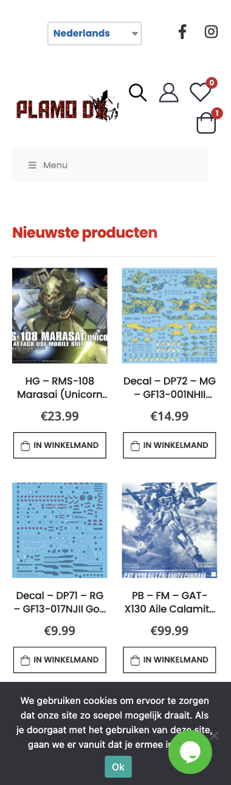
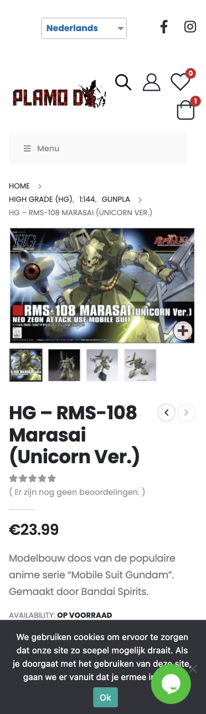
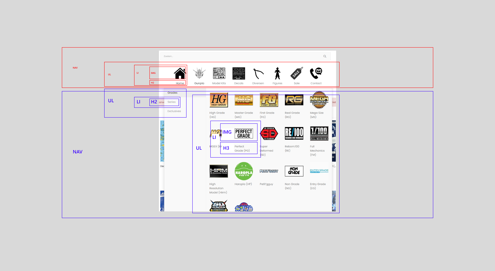
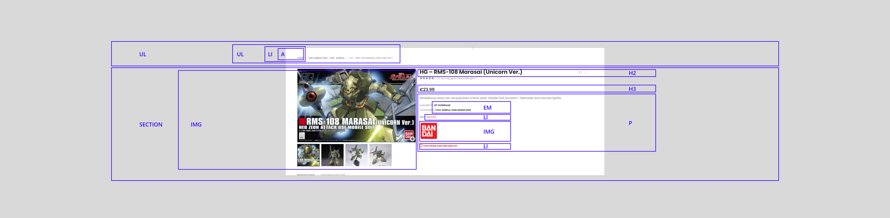

# Procesverslag
Markdown is een simpele manier om HTML te schrijven.  
Markdown cheat cheet: [Hulp bij het schrijven van Markdown](https://github.com/adam-p/markdown-here/wiki/Markdown-Cheatsheet).

Nb. De standaardstructuur en de spartaanse opmaak van de README.md zijn helemaal prima. Het gaat om de inhoud van je procesverslag. Besteedt de tijd voor pracht en praal aan je website.

Nb. Door *open* toe te voegen aan een *details* element kun je deze standaard open zetten. Fijn om dat steeds voor de relevante stuk(ken) te doen.

## Jij

  
uitwerken voor kick-off werkgroep

  ### Auteur:
  Marc Bakker

  #### Je startniveau:
  Blauw als basis, als het lukt werken aan rood

  #### Je focus:
  Responsive
 

## Je website

  
GEDAAN | uitwerken voor kick-off werkgroep

  ### Je opdracht:
  https://plamodx.nl/

  #### Screenshot(s) van de eerste pagina (small screen): 
  Modelkit webshop voorpagina  
  

  #### Screenshot(s) van de tweede pagina (small screen):
  Modelkit webshop detailpagina
  
 

## Toegankelijkheidstest 1/2 (week 1)

  
GEDAAN | uitwerken na test in 1e werkgroep

  ### Bevindingen
  Ik had al verwacht dat deze site wat minder toegankelijk is aangezien het een reletief klein bedrijf is. Maar het viel erg tegen, er was veel te noteren wat niet helemaal werkt voor sommige mensen. Bijvoorbeeld navigeren met tab laat heel veel kleine foutjes zien, zoals: geen styling op focus, en veel herhalende links die hetzelfde doen. Dat is ook irritant voor mensen die een screen reader gebruiken.

  #### Screenreader
  </ul>
    <li>Menu's werken niet, moeten simpler</li>
    <li>Afbeeldingen niet duidelijk beschreven</li>
    <li>Links missen duidelijkheid bijvoorbeeld prijs</li>
    <li>Producten kunnnen beter beschreven worden, zoals textuur, maat, kleur etc.</li>
  <ul>

  #### Muis en Toetsenbord 
  </ul>
    <li>Focus state wordt meestal niet vormgegeven, geen eens basis outlines</li>
    <li>Je hebt geen optie voor skip to content</li>
    <li>Dropdown menu's hebben geen tab optie</li>
  <ul>

  #### Motoriek (shocks, elastiekjes)
  </ul>
    <li>Met shocks kan je met muis (bijna) prima besturen, typen is niet te doen</li>
    <li>Met shocks kan je beter de website zo veel mogelijk muis accesible</li>
    <li>Elastiek met computer gaat het nog wel</li>
    <li>Met elastiek zijn de touchscreen koop buttons te klein</li>
  <ul>

  #### Visueel (brillen, contrast, kleurenblind, dark/light). 
  </ul>
    <li>Geen dark mode</li>
    <li>Blur vision, kleine knopjes die groen, blauw zijn met witte tekst zijn niet te zien</li>
    <li>Zwart wit is prima, kleuren deficienties zijn ook prima</li>
  <ul>

## Breakdownschets (week 1)

  
GEDAAN | uitwerken na afloop 2e werkgroep

  ### de hele pagina: 
  

  ### dynamisch deel (bijv menu): 
  

  ### wellicht nog een dynamisch deel (bijv filter): 
  

## Voortgang 1 (week 2)

  
uitwerken voor 1e voortgang

  ### Stand van zaken
  hier dit ging goed & dit was lastig (neem ook screenshots op van delen van je website en code)

  ### Agenda voor meeting
  samen met je groepje opstellen

  | student 1      | student 2          | student 3    | student 4        |
  | ---            | ---                | ---          | ---              |
  | dit bespreken  | en dit             | en ik dit    | en dan ik dat    |
  | en dat ook nog | dit als er tijd is | nog een punt | dit wil ik zeker |
  | ...            | ...                | ...          | ...              |

  | student 1 MARC     | student 2 ROBIN         | student 3 AYA   | student 4        |
  | ---            | ---                | ---          | ---              |
  | HTML en CSS kort laten zien voor feedback, geen directe vragen  | Kun je grid, flexbox en position door elkaar gebruiken? Of kan het ook anders? | Eigen website: hoe zijn hier de h'tjes verdeeld (h1, h2, etc.)? | "een plan opstellen ivm huiswerk" |
  | en dat ook nog | Is mijn HTML goed uitgewerkt? Of wat mist er nog of kan beter? | nog een punt | dit wil ik zeker |
  | ...            | ...                | ...          | ...              |

  Algemeen, gehele groep
  -Hoe werkt een hamburger menu
  -Feedback voor onze github, vullen we het goed in?

  ### Verslag van meeting
  hier na afloop snel de uitkomsten van de meeting vastleggen

  - punt 1
  - punt 2
  - nog een punt
  - ...

## Voortgang 2 (week 3)

  
uitwerken voor 2e voortgang

  ### Stand van zaken
  hier dit ging goed & dit was lastig (neem ook screenshots op van delen van je website en code)

  ### Agenda voor meeting
  samen met je groepje opstellen

  | student 1      | student 2          | student 3    | student 4        |
  | ---            | ---                | ---          | ---              |
  | dit bespreken  | en dit             | en ik dit    | en dan ik dat    |
  | en dat ook nog | dit als er tijd is | nog een punt | dit wil ik zeker |
  | ...            | ...                | ...          | ...              |

  ### Verslag van meeting
  hier na afloop snel de uitkomsten van de meeting vastleggen

  - punt 1
  - punt 2
  - nog een punt
- ...

## Toegankelijkheidstest 2/2 (week 4)

  
uitwerken na test in 8e werkgroep

  ### Bevindingen
  Lijst met je bevindingen die in de test naar voren kwamen (geef ook aan wat er verbeterd is):

  #### Screenreader
  Hier korte omschrijving (met indien nodig afbeeldingen)

  Hier een omschrijving van hoe het opgelost kan worden (met indien nodig afbeeldingen)

  #### Muis en Toetsenbord 
  Hier korte omschrijving (met indien nodig afbeeldingen)

  Hier een omschrijving van hoe het opgelost kan worden (met indien nodig afbeeldingen)

  #### Motoriek (shocks, elastiekjes)
  Hier korte omschrijving (met indien nodig afbeeldingen)

  Hier een omschrijving van hoe het opgelost kan worden (met indien nodig afbeeldingen)

  #### Visueel (brillen, contrast, kleurenblind, dark/light). 
  Hier korte omschrijving (met indien nodig afbeeldingen)

  Hier een omschrijving van hoe het opgelost kan worden (met indien nodig afbeeldingen)

## Voortgang 3 (week 4)

  
uitwerken voor 3e voortgang

  ### Stand van zaken
  hier dit ging goed & dit was lastig (neem ook screenshots op van delen van je website en code)

  ### Agenda voor meeting
  samen met je groepje opstellen

  | student 1      | student 2          | student 3    | student 4        |
  | ---            | ---                | ---          | ---              |
  | dit bespreken  | en dit             | en ik dit    | en dan ik dat    |
  | en dat ook nog | dit als er tijd is | nog een punt | dit wil ik zeker |
  | ...            | ...                | ...          | ...              |

  ### Verslag van meeting
  hier na afloop snel de uitkomsten van de meeting vastleggen

  - punt 1
  - punt 2
  - nog een punt
  - ...

## Eindgesprek (week 5)

  
uitwerken voor eindgesprek

  ### Je uitkomst - karakteristiek screenshots:
  

  ### Dit ging goed/Heb ik geleerd: 
  Korte omschrijving met plaatjes

  

  ### Dit was lastig/Is niet gelukt:
  Korte omschrijving met plaatjes

  

## Bronnenlijst

  
continu bijhouden terwijl je werkt

  Nb. Wees specifiek ('css-tricks' als bron is bijv. niet specifiek genoeg).

</ol>
  <li>Bron: HTML select element <a href="https://developer.mozilla.org/en-US/docs/Web/HTML/Element/select">https://developer.mozilla.org/en-US/docs/Web/HTML/Element/select</a></li>
  <li>Bron: Icon instagram<a href="https://www.iconfinder.com/search?q=instagram">https://www.iconfinder.com/search?q=instagram</a></li>
  <li>Bron: Icon facebook<a href="https://www.iconfinder.com/search?q=facebook">https://www.iconfinder.com/search?q=facebook</a></li>
  <li>Bron: Icon ideal<a href="https://www.autolakstift.nl/ideal-logo/">https://www.autolakstift.nl/ideal-logo/</a></li>
  <li>Bron: Icon bancontact<a href="https://www.autolakstift.nl/bancontact/">https://www.autolakstift.nl/bancontact/</a></li>
  <li>Bron: Icon paypal<a href="https://nl.m.wikipedia.org/wiki/Bestand:PayPal.svg">https://nl.m.wikipedia.org/wiki/Bestand:PayPal.svg</a></li>
  <li>Bron: Icon giropay<a href="https://en.wikipedia.org/wiki/Giropay">https://en.wikipedia.org/wiki/Giropay</a></li>
  <li>Bron: Logo +Iconset plamodx<a href="https://plamodx.nl/">https://plamodx.nl/</a></li>
  <li>Bron: Product foto's plamodx<a href="https://plamodx.nl/">https://plamodx.nl/</a></li>
  <li>Bron: </li>
<ol>

